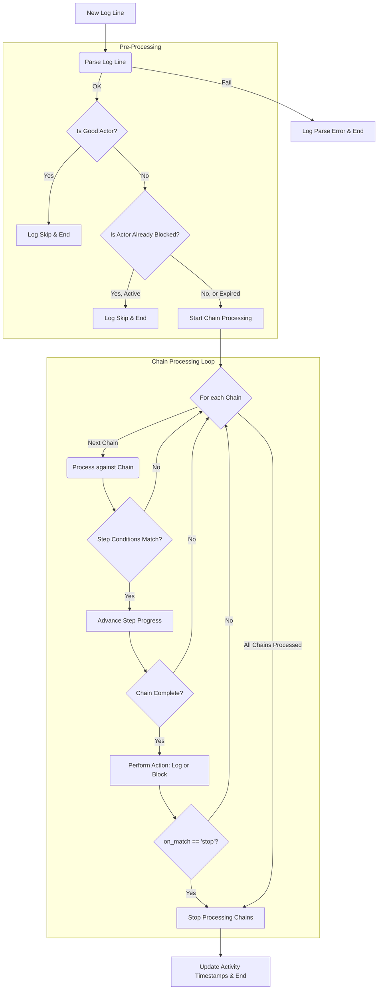

# Bot-Detector: Behavioral Threat Mitigation

Bot-Detector is a high-performance Go application designed to monitor live access logs, identify malicious or anomalous behavior using configurable behavioral chains, and dynamically block offending IP addresses via the configured blocking backend.

## How It Works

The application operates in a continuous loop:

1.  **Tails log files** (like HAProxy or Nginx access logs) in real-time - supports both single and multi-website modes.
2.  **Parses each new log line** against a configurable regex format defined in the config file.
3.  **Checks the entry** against a series of behavioral chains defined in the YAML configuration file.
4.  **Tracks the state** of each IP address (or IP+User-Agent) as it progresses through these chains.
5.  **Executes an action** (e.g., `block` or `log`) when a chain is completed.
6.  **Manages state** by cleaning up idle or irrelevant IP tracking data to conserve memory.

## Features

*   **Multi-Website Support:** Monitor multiple websites with separate log files, each with global and website-specific detection rules.
*   **Real-Time Behavioral Analysis:** Uses flexible YAML configurations to detect sequential patterns.
*   **Blocker Integration:** Executes immediate IP blocking via the configured backend (e.g., HAProxy Runtime API, TCP or Unix Socket).
*   **High Resilience:** Handles backend instance unavailability by logging the failure and continuing operation.
*   **Configuration Hot-Reload:** Automatically detects and applies changes to the YAML configuration file and its file-based dependencies without a restart.
*   **Cluster Support:** Run multiple nodes in a leader-follower configuration for high availability. Followers automatically sync configuration from the leader with integrity verification.
*   **Log Rotation Safe:** Continuously tails log files, automatically re-opening the file after log rotation events.
*   **Graceful Shutdown:** Implements signal handlers (SIGINT, SIGTERM) for safe, controlled process termination.
*   **Dry Run Mode:** Allows testing behavioral chains against static log files without affecting a live blocking backend.
*   **Memory Optimization:** Automatically purges state for IPs that are no longer relevant, minimizing memory footprint.
*   **Metrics & Configuration API:** An optional embedded web server (enabled with `--listen`) provides live performance metrics and allows for inspecting and archiving the running configuration. See [API.md](docs/API.md) for details.

## Building the Application

To compile the source code, you must first initialize the Go module and fetch the external dependencies (specifically `gopkg.in/yaml.v3`).

1. **Initialize the Go Module:**

```sh
go mod init bot_detector
```

2. **Fetch Dependencies:**

```sh
go mod tidy
```

3. **Build the Executable:**

```sh
go build -o bot-detector ./cmd/bot-detector
```

This will produce a single executable named `bot-detector`.

## Setup and Usage

### Blocker Configuration (CRITICAL)

The bot-detector only sends block commands to HAProxy; it does not configure HAProxy itself. For blocking to work, you must configure your HAProxy instance with the necessary **stick tables and ACLs** to act on the information sent by this application.

This is a critical prerequisite. See [HaproxySetup.md](docs/HaproxySetup.md) for a detailed guide and example configuration.

### Running the Bot-Detector

The application is configured using a configuration directory containing a YAML file named `config.yaml` and a few command-line flags.

**Important:** The `--config-dir` flag specifies a **directory path**, not a file path. This directory must contain a file named `config.yaml`, which is the main configuration file. Additional dependency files referenced in the configuration (via `file:` directives) are resolved relative to this directory.

#### Production Mode (Live Tailing and Blocking)

```sh
./bot-detector \
  --log-path "/var/log/haproxy/access.log" \
  --config-dir "/etc/bot-detector"
```

#### Dry Run Mode (Testing)

Use `--dry-run` to test your chains against a static log file. This will process the file once and log all match actions without attempting to connect to the configured blocking backend (even if the chain action is `block`).

If `--log-path` is provided, it will read from that file. If `--log-path` is omitted in dry-run mode, the application will read from standard input (`stdin`), allowing you to pipe log data into it.

```sh
# Reading from a file (config directory contains `config.yaml`)
./bot-detector --dry-run \
  --log-path "test_access.log" \
  --config-dir "./testdata"

# Reading from stdin
cat test_access.log | ./bot-detector --dry-run --config-dir "./testdata"
```

## Operational Behavior

### Blocker Fail-Safe

If a blocker instance is unavailable during a block or unblock attempt (e.g., it is restarting or down), the program will log the connection error and continue its operation. The command will be attempted on other configured blocker instances, and the application will continue to process logs and attempt future blocks. It does not enter a persistent "passive mode"; it simply reports the failure for that specific event.

### Rate-Limited Command Queue

To prevent overwhelming the blocking backend (e.g., HAProxy) during a sudden burst of activity, the bot-detector does not execute block or unblock commands immediately. Instead, all commands are sent to an in-memory queue.

A separate worker process consumes commands from this queue at a configurable rate, defined by `blockers.commands_per_second` in the YAML configuration (default: 100 commands/sec). This ensures that the backend is not flooded with requests.

The queue itself has a configurable size (`blockers.command_queue_size`, default: 10000). If the rate of incoming commands exceeds the processing rate and the queue becomes full, any new commands will be dropped, and a warning will be logged. This design makes the system resilient to high-volume detection events without causing a "thundering herd" problem on the backend services.

## Log Processing

### Log Rotation

The bot-detector monitors the unique file identifier (inode) of the log file. If the file is renamed or truncated (as happens during logrotate), the application detects the change, closes the old handle, and re-opens the new log file to ensure continuous log processing.

## Cluster Configuration

Bot-detector supports running multiple nodes in a leader-follower architecture for high availability and configuration management.
See [Cluster Configuration](docs/ClusterConfiguration.md) and [Cluster and Docker](docs/ClusterAndDocker.md) for details.

## Command-Line Flags

| Flag | Arg. Type | Description |
| :--- | :--- | :--- |
| **`--check`** | | Validates the configuration and exits with error code on failure. |
| **`--cluster-node-name`** | string | Name of the node (cluster mode). |
| **`--config-dir`** | dirpath | **Path to the configuration directory** containing `config.yaml`. |
| **`--dry-run`** | | Runs in test mode, ignoring the blocking backend and live logging. |
| **`--dump-backends`** | | Checks HAProxy backend sync status, lists all IPs, and exits. |
| **`--exit-on-eof`** | | Exits after processing the log file to EOF instead of tailing. |
| **`--help`** | | Display command-line help. |
| **`--listen`** | string | Starts a web server on this address (e.g., `:8080` or `:8080,role=api`). Can be specified multiple times for multiple listeners. |
| **`--log-path`** | filepath | Path to the access log file to tail (or to read in dry-run mode). |
| **`--reload-on`** | string | Controls config reloading: `watcher`, `HUP`, `USR1`, or `USR2`. |
| **`--state-dir`** | dirpath | Path to the state directory. Enables persistence if set. |
| **`--top-n`** | number | In dry-run mode, show top N actors per chain. |
| **`--version`** | | Print the application version and exit. |

### Listen Flag Options

The `--listen` flag supports multiple formats and can be specified multiple times:

**Basic usage:**
```bash
# Single listener on all interfaces
--listen :8080

# Multiple listeners
--listen :8080 --listen :9090

# IPv4 and IPv6 explicit
--listen 0.0.0.0:8080 --listen [::]:8080
```

**Role-based routing:**
```bash
# Separate API and metrics endpoints
--listen :8080,role=api --listen :9090,role=metrics

# Multiple roles on one listener
--listen :8080,role=api+metrics

# Cluster communication on dedicated port
--listen :8080 --listen :9090,role=cluster
```

**Available roles:**
- `api` - Configuration and IP lookup endpoints
- `metrics` - Metrics and stats endpoints
- `cluster` - Cluster communication endpoints
- `all` - Serves all endpoints (default when no role specified)

**Routing rules:**
- If no roles specified on any listener → all listeners serve all endpoints
- If roles specified on at least one listener → role-based routing applies
- Listeners without roles serve endpoints not claimed by role-specific listeners

## Configuration

The bot-detector is configured using a YAML file (`config.yaml`) that defines behavioral chains, blocker settings, parser options, and more.

For detailed configuration documentation, including all available options, field descriptions, matcher syntax, and examples, see [Configuration.md](docs/Configuration.md).

## Logic Flow Diagram

This diagram illustrates the journey of a single log entry as it's processed by the bot-detector:



## Documentation

### Contributing

- [CONTRIBUTING.md](CONTRIBUTING.md) - Development environment setup, code quality checks, and contribution guidelines

### Configuration and Setup

- [Configuration.md](docs/Configuration.md) - Complete configuration reference including all YAML options, matcher syntax, and examples
- [HaproxySetup.md](docs/HaproxySetup.md) - HAProxy configuration guide for stick tables, ACLs, and runtime API setup

### Deployment

- [Docker.md](docs/Docker.md) - Building and running bot-detector in Docker containers
- [ClusterConfiguration.md](docs/ClusterConfiguration.md) - Setting up multi-node leader-follower clusters for high availability
- [ClusterAndDocker.md](docs/ClusterAndDocker.md) - Running bot-detector clusters with Docker and Docker Compose

### Advanced Features

- [API.md](docs/API.md) - HTTP API endpoints for metrics, configuration inspection, and cluster management
- [Persistence.md](docs/Persistence.md) - State persistence configuration for maintaining blocks across restarts
