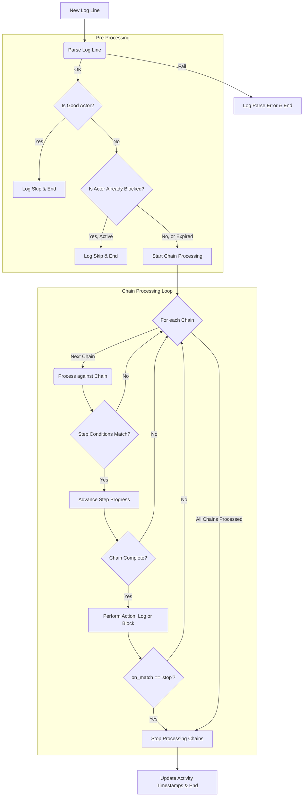

# **Bot-Detector: Behavioral Threat Mitigation**

Bot-Detector is a high-performance Go application designed to monitor live access logs, identify malicious or anomalous behavior using configurable behavioral chains, and dynamically block offending IP addresses via the configured blocking backend.

## How It Works

The application operates in a continuous loop:

1.  **Tails a log file** (like an HAProxy or Nginx access log) in real-time.
2.  **Parses each new log line** against a configurable regex format defined in the config file.
3.  **Checks the entry** against a series of behavioral chains defined in the YAML configuration file.
4.  **Tracks the state** of each IP address (or IP+User-Agent) as it progresses through these chains.
5.  **Executes an action** (e.g., `block` or `log`) when a chain is completed.
6.  **Manages state** by cleaning up idle or irrelevant IP tracking data to conserve memory.

## **Features**

*   **Real-Time Behavioral Analysis:** Uses flexible YAML configurations to detect sequential patterns.
*   **Blocker Integration:** Executes immediate IP blocking via the configured backend (e.g., HAProxy Runtime API, TCP or Unix Socket).
*   **High Resilience:** Handles backend instance unavailability by logging the failure and continuing operation.
*   **Configuration Hot-Reload:** Automatically detects and applies changes to the YAML configuration file and its file-based dependencies without a restart.
*   **Log Rotation Safe:** Continuously tails log files, automatically re-opening the file after log rotation events.
*   **Graceful Shutdown:** Implements signal handlers (SIGINT, SIGTERM) for safe, controlled process termination.
*   **Dry Run Mode:** Allows testing behavioral chains against static log files without affecting a live blocking backend.
*   **Memory Optimization:** Automatically purges state for IPs that are no longer relevant, minimizing memory footprint.

## **Setup and Usage**

### **Step 1: Blocker Configuration (CRITICAL)**

The bot-detector only sends block commands to HAProxy; it does not configure HAProxy itself. For blocking to work, you must configure your HAProxy instance with the necessary **stick tables and ACLs** to act on the information sent by this application.

This is a critical prerequisite. See [HaproxySetup.md](docs/HaproxySetup.md) for a detailed guide and example configuration.


### **Step 2: Running the Bot-Detector**

The application is configured using a YAML file and a few command-line flags.

#### **Production Mode (Live Tailing and Blocking)**

```sh
./bot-detector \
  --log-path "/var/log/haproxy/access.log" \
  --config "/etc/bot-detector/config.yaml"
```

#### **Dry Run Mode (Testing)**

Use `--dry-run` to test your chains against a static log file. This will process the file once and log all match actions without attempting to connect to the configured blocking backend (even if the chain action is `block`).

If `--log-path` is provided, it will read from that file. If `--log-path` is omitted in dry-run mode, the application will read from standard input (`stdin`), allowing you to pipe log data into it.

```sh
# Reading from a file
./bot-detector --dry-run \
  --log-path "test_access.log" \
  --config "config.yaml"

# Reading from stdin
cat test_access.log | ./bot-detector --dry-run --config "config.yaml"
```

## **Resilience and Logging**

### **Blocker Fail-Safe**

If a blocker instance is unavailable during a block or unblock attempt (e.g., it is restarting or down), the program will log the connection error and continue its operation. The command will be attempted on other configured blocker instances, and the application will continue to process logs and attempt future blocks. It does not enter a persistent "passive mode"; it simply reports the failure for that specific event.

### **Log Rotation**

The bot-detector monitors the unique file identifier (inode) of the log file. If the file is renamed or truncated (as happens during logrotate), the application detects the change, closes the old handle, and re-opens the new log file to ensure continuous log processing.

### **Rate-Limited Blocker**

To prevent overwhelming the blocking backend (e.g., HAProxy) during a sudden burst of activity, the bot-detector does not execute block or unblock commands immediately. Instead, all commands are sent to an in-memory queue.

A separate worker process consumes commands from this queue at a configurable rate, defined by `blocker_commands_per_second` in the YAML configuration (default: 10 commands/sec). This ensures that the backend is not flooded with requests.

The queue itself has a configurable size (`blocker_command_queue_size`, default: 1000). If the rate of incoming commands exceeds the processing rate and the queue becomes full, any new commands will be dropped, and a warning will be logged. This design makes the system resilient to high-volume detection events without causing a "thundering herd" problem on the backend services.


## **Building the Application**

To compile the source code, you must first initialize the Go module and fetch the external dependencies (specifically `gopkg.in/yaml.v3`).

1. **Initialize the Go Module:**

```sh
go mod init bot_detector
```

2. **Fetch Dependencies:**

```sh
go mod tidy
```

3. **Build the Executable:**

```sh
go build -o bot-detector .
```

This will produce a single executable named `bot-detector`.

## **Command-Line Flags (Execution)**

| Flag | Default | Description |
| :--- | :--- | :--- |
| **`--config`** | (none) | **Required.** Path to the YAML configuration file. |
| **`--log-path`** | (none) | **Required.** Path to the access log file to tail (or to read in dry-run mode). |
| **`--dry-run`** | `false` | Optional. If true, runs in test mode, ignoring the configured blocking backend and live logging. |
| **`--version`** | `false` | Optional. Print the application version and exit. |
| **`--reload-on-signal`** | (none) | Optional. If set to a signal name (e.g., `HUP`, `USR1`), disables the file watcher and reloads the configuration upon receiving that signal. |
| **`--http-listen-addr`** | `""` | Optional. If set (e.g., `"127.0.0.1:8080"`), starts a web server on this address to display live metrics. Disabled by default. |
| **`--top-n`** | `0` | Optional. In dry-run mode, show top N actors per chain. Default is 0 (disabled). |

---

### **Log Levels (in the YAML config file)**

The application uses a unified logging system with five discrete levels. The `--log-level` flag controls the minimum severity level that will be displayed in the output.

| Level | Severity | Description |
| :--- | :--- | :--- |
| **`critical`** | **0** (Highest) | Only displays actions that modify state or terminate the program (e.g., **IP blocks**, graceful **SHUTDOWN**). |
| **`error`** | **1** | Displays severe, non-fatal issues (e.g., file read errors, **Blocker connection failures** that trigger fail-safe). |
| **`warning`** | **2** (Default) | Includes non-critical operational issues that should be reviewed (e.g., failed timestamp parsing, malformed URL referrers). |
| **`info`** | **3** | Includes major application lifecycle events (e.g., configuration **LOAD**, **DRY_RUN** start/completion, tailing start). |
| **`debug`** | **4** (Lowest) | The most verbose level. Includes high-volume internal logic like individual step **MATCH**. |

# **Behavioral Chains Configuration File (config.yaml)**

This file defines the sequential behavioral chains used by the bot-detector to identify and act upon suspicious traffic patterns.
The file is structured as a top-level map containing a single key, chains, which holds an array of individual chain definitions.

## **Root Structure**

| Field | Type | Description |
| :---- | :---- | :---- |
| **version** | string | The configuration version. Must match a supported version (e.g., "1.0"). |
| **chains** | list of objects | The list of behavioral chains to be loaded. |
| **good_actors** | list of objects | Optional. A list of trusted actors to skip from all processing. |
| **log_level** | string | Optional. Set minimum log level: `critical`, `error`, `warning`, `info`, `debug`. Default: `warning`. |
| **polling_interval** | string | Optional. Interval to check this file for changes. Default: `5s`. A minimum of `1s` is enforced. |
| **cleanup_interval**| string | Optional. Interval to run the routine that cleans up idle IP state. Default: `1m`. |
| **line_ending** | string | Optional. Specifies the expected line ending for log parsing. Can be `lf` (Unix, default), `crlf` (Windows), or `cr` (Classic Mac). |
| **idle_timeout** | string | Optional. Duration an IP must be inactive before its state is purged. Default: `30m`. |
| **out_of_order_tolerance** | string | Optional. Maximum duration an out-of-order log entry will be processed. Default: `5s`. |
| **timestamp_format** | string | Optional. The time format layout string (per Go's `time.Parse` syntax) for parsing timestamps. Default: `02/Jan/2006:15:04:05 -0700`. |
| **log_format_regex** | string | Optional. A Go-compatible regex to parse log lines. **Required capture groups:** `IP`, `Timestamp`. **Optional groups:** `Method`, `Path`, `StatusCode`, `Size`, `Referrer`, `UserAgent`. If an optional group is omitted, its value will be treated as empty. If not provided, the application defaults to a regex that expects a **virtual-host-prefixed combined log format**. |
| **default_block_duration** | string | Optional. A global block duration to apply to any `block` action chain that does not define its own `block_duration`. Format: Go duration string (e.g., "5m", "1h"). |
| **blocker_max_retries** | int | Optional. Number of attempts to send a command to a blocker instance. Default: `3`. |
| **blocker_addresses** | array of string | A list of all blocker control endpoints (TCP `host:port` or Unix socket paths) across the cluster. |
| **blocker_retry_delay** | string | Optional. Duration to wait between retry attempts. Default: `200ms`. |
| **blocker_dial_timeout** | string | Optional. Timeout for establishing a connection to a blocker socket. Default: `5s`. |
| **blocker_command_queue_size** | int | Optional. The maximum number of commands that can be queued for the blocker. Default: `1000`. |
| **unblock_on_good_actor** | boolean | Optional. If `true`, the application will issue an `unblock` command for an IP that matches a `good_actors` rule. Default: `false`. |
| **unblock_cooldown** | string | Optional. The minimum time that must pass before another `unblock` command is sent for the same IP. Prevents command spam. Default: `5m`. |
| **blocker_commands_per_second** | int | Optional. The maximum number of commands per second to send to the blocker. Default: `10`. |

#### A Note on Durations

All duration fields in the configuration (e.g., `idle_timeout`, `block_duration`, `max_delay`) are parsed as Go duration strings (extended to day and week for convenience). This format is a sequence of decimal numbers, each with a unit suffix.

The valid time units are:
* `ms` (millisecond)
* `s` (second)
* `m` (minute)
* `h` (hour)
* `d` (day, equivalent to `24h`)
* `w` (week, equivalent to `168h`)

Units can be combined in descending order of magnitude (e.g., `"1w2d3h4m5s"`).

#### Default Log Format Example

If `log_format_regex` is not specified, the application expects lines to follow this format:

`vhost ip - user [timestamp] "method path protocol" status size "referrer" "user-agent"`

Example:
`www.example.com 192.168.1.1 - - [02/Jan/2006:15:04:05 -0700] "GET /path HTTP/1.1" 200 1234 "http://referrer.com" "MyBrowser/1.0"`

## **`good_actors` (Trusted Actor Skipping)**

You can define a set of "good actors" that should always be skipped from all behavioral chain processing. This is useful for allow-listing trusted IP addresses or User-Agents, such as internal monitoring services, known friendly bots, or office networks.

When a log entry matches a `good_actors` rule, it is immediately ignored, and no chains are evaluated for it.

The `good_actors` key is a list of objects. Each object must have a unique `name` and a definition containing an `ip` and/or `useragent` matcher.

*   If only `ip` is defined, any entry with a matching IP is skipped.
*   If only `useragent` is defined, any entry with a matching User-Agent is skipped.
*   If **both** `ip` and `useragent` are defined, it creates an **AND** condition. The entry is only skipped if **both** the IP and User-Agent match the rule. This is useful for preventing IP spoofing of trusted bots.

The values for `ip` and `useragent` use the same powerful syntax as `field_matches`, supporting simple strings, `regex:`, `cidr:`, `file:`, and lists.

### Example `good_actors` Configuration

```yaml
good_actors:
  # Actors from our internal network are always trusted.
  # This uses a file containing a list of CIDR blocks.
  - name: "our_network"
    ip: "file:./internal_ips.txt"

  # A specific monitoring service that should be ignored.
  # This uses a case-insensitive regex to match the User-Agent.
  - name: "monitoring_agent"
    useragent: "regex:(?i)HealthCheck"

  # A known, trusted bot that is only considered trusted if BOTH its IP and User-Agent match.
  # This prevents spoofing from other IPs that might use the same User-Agent.
  - name: "known_friendly_bot"
    ip: "8.8.8.8"
    useragent: "regex:(?i)FriendlyBot"

  # A list of specific partner server IPs can also be provided directly.
  - name: "partner_servers"
    ip:
      - "203.0.113.10"
      - "203.0.113.11"
```

## **BehavioralChain Definition (Top Level)**

Each item in the chains array must conform to the following structure:

| Field | Type | Required | Description |
| :---- | :---- | :---- | :---- |
| **name** | string | Yes | A unique, descriptive name for the chain (e.g., API-Abuse-Low-Agent). |
| **steps** | array of object | Yes | The sequential list of steps that define the malicious pattern. |
| **action** | string | Yes | The action to take when the chain is successfully completed. Must be one of: `block` or `log`. To temporarily disable a chain, prefix the action with `!` (e.g., `!block`). The chain will be ignored. |
| **block_duration** | string | No | The duration for which the IP should be blocked if action is `block`. Format: Go duration string (e.g., "5m", "1h", "30m", "1h30m"). |
| **match_key** | string | Yes | The key used to track activity. This determines if behavior is tracked per IP address, per IP version, or per unique client (IP + User-Agent). See the table below for all possible values. |
| **on_match** | string | No | Optional. If set to `"stop"`, no further behavioral chains will be processed for the current log entry after this chain completes. This can be used to optimize performance or enforce exclusive matching. |

#### Chain Processing Order

Chains are processed for each log entry in the order they are defined in the `chains` array. This means you should place more specific or higher-priority chains before more general ones.

When a chain with `on_match: "stop"` is completed, the application immediately stops evaluating any subsequent chains for that log entry. This makes ordering critical for creating efficient and logical detection rules. For example, you might place a very specific, high-confidence "block" chain first, followed by more general "log-only" chains.

#### `match_key` Values

The `match_key` defines **what constitutes a unique actor** when tracking behavior across multiple log entries. It is the key used in the internal state machine to link a sequence of requests to a single source.

> **Why is there no `ua`-only key?**
> A `match_key` based only on the User-Agent is intentionally not supported. User-Agent strings are trivial for an attacker to change with every request. If tracking were based solely on this value, a malicious actor could completely evade detection by sending a different User-Agent each time, as the detector would see each request as coming from a brand new "actor" and no behavioral chain could ever progress. The IP address is the only mandatory, non-spoofable component for tracking state.

| `match_key` | Tracks By | Description |
| :--- | :--- | :--- |
| `ip` | IP Address (v4 or v6) | Tracks activity based on the client's IP address, regardless of whether it's IPv4 or IPv6. |
| `ipv4` | IPv4 Address Only | Tracks activity based on the client's IP address. This chain will only process log entries with a valid IPv4 address. |
| `ipv6` | IPv6 Address Only | Tracks activity based on the client's IP address. This chain will only process log entries with a valid IPv6 address. |
| `ip_ua` | IP (v4/v6) + User-Agent | Tracks activity based on the combination of the client's IP address (v4 or v6) and their User-Agent string. This is useful for distinguishing different bots or clients behind the same NAT. |
| `ipv4_ua` | IPv4 + User-Agent | Tracks activity based on the combination of the client's IPv4 address and their User-Agent string. Ignores IPv6 entries. |
| `ipv6_ua` | IPv6 + User-Agent | Tracks activity based on the combination of the client's IPv6 address and their User-Agent string. Ignores IPv4 entries. |

### Internal State: How `match_key` Connects to Chains and Steps

The `match_key` is fundamental to how the bot-detector tracks behavior. Internally, the application maintains an in-memory state map (the "Activity Store") that links an "actor" to their progress through various behavioral chains.

1.  **Defining an Actor:** The `match_key` from a chain definition tells the detector how to create a unique `Actor` for each log entry. This key represents the actor.
    *   If `match_key` is `ip`, the `Actor` is just the IP address.
    *   If `match_key` is `ip_ua`, the `Actor` is the combination of the IP address and the User-Agent string.

2.  **Tracking Activity:** This `Actor` is used to look up an `ActorActivity` object in the Activity Store. This object holds all state for that specific actor, including:
    *   The timestamp of the actor's last request.
    *   Whether the actor is currently blocked (and until when).
    *   A map of `ChainProgress`, which stores the actor's current step for every chain they have started.

3.  **Processing Steps:** When a log entry comes in, the detector iterates through all configured chains. For each chain:
    *   It generates the appropriate `Actor` based on the chain's `match_key`.
    *   It retrieves the actor's `ActorActivity`.
    *   It looks at the `ChainProgress` for that specific chain to see which step is next.
    *   It evaluates the log entry against the conditions of that next step.

This design is what allows the system to track complex, overlapping behaviors. For example, a single IP address `1.2.3.4` can be simultaneously tracked for two different activities:

*   As the actor `1.2.3.4` for a chain with `match_key: ip`.
*   As the completely separate actor `1.2.3.4` + `"SomeBot/1.0"` for a different chain with `match_key: ip_ua`.

Progress or completion of one chain does not affect the other unless an `on_match: "stop"` rule is triggered.

## **Step Definition**

Each step in the steps array defines a specific log entry characteristic that must occur in sequence to progress the chain.

| Field | Type | Required | Description |
| :---- | :---- | :---- | :---- |
| **field_matches** | map | Yes | A set of key-value pairs defining the conditions for the step to match. See the `field_matches` section below for details on the powerful new syntax. |
| **max_delay** | string | No | **(Steps 2+)** The maximum allowed time between the previous step and this one. If exceeded, the chain resets. Ignored on the first step. Format: Go duration string (e.g., "10s", "1m"). |
| **min_delay** | string | No | **(Steps 2+)** The minimum required time between the *previous successful step in this chain* and the current step. If not met, the chain resets. Ignored on the first step. Format: Go duration string (e.g., "10s", "1m"). |
| **min_time_since_last_hit** | string | No | **(First Step Only)** The first step will only match if the time since the *last overall request* from the same actor (`match_key`) is **greater than** this duration. If the last request was too recent, or if the actor has never been seen before, the step will not match. This is useful for detecting "sleepy" bots that have long periods of inactivity between requests. When used in a chain with `match_key: "ip_ua"`, this check is performed independently for each unique IP and User-Agent combination, allowing the detector to distinguish between different bots operating from the same IP address. This setting is ignored on all subsequent steps. Format: Go duration string (e.g., "30m", "12h"). |

### `field_matches`

| Field | Description |
| :--- | :--- |
| **ip** | The client IP address. |
| **method** | The HTTP request method (e.g., `GET`, `POST`). A malformed request in the log (e.g., `"-"`) is parsed as an empty string. |
| **path** | The requested URL path. |
| **statuscode**, `status_code` | The HTTP response status code (e.g., `200`, `404`). |
| **referrer** | The full HTTP Referer header value. |
| **size** | The response size in bytes. A dash (`"-"`) in the log is parsed as `-1`. |
| **useragent** | The HTTP User-Agent header value. |
| **vhost** | The virtual host from the log entry. |

### **Advanced `field_matches` Syntax**

The `field_matches` block supports a flexible syntax for defining match conditions, making your rules both powerful and easy to read.

#### **Simple Values (Shorthand)**

The simplest match is a direct value. The parser intelligently determines the match type.

*   **Exact String Match (Default for strings):**
    ```yaml
    method: "POST"
    ```
*   **Exact Integer Match (Default for numbers):**
    ```yaml
    statuscode: 404
    ```

#### **Prefixed String Matchers**

For more complex string matching, use a prefix.

> #### **A Note on Prefix Parsing**
>
> The parser is strict about how it identifies and handles prefixes to ensure that matching is predictable and explicit.
>
> *   **Prefixes Must Be at the Start:** A prefix (`regex:`, `exact:`, `file:`, `cidr:`) is only detected if it appears at the very beginning of a string value.
>
> *   **Leading Spaces Matter:** If there are any leading spaces before a prefix, the string is **not** treated as a directive. Instead, it is treated as a literal string for an exact match.
>
> *   **Spaces in Values are Preserved:** For directives, the value is everything that follows the prefix, including any leading or trailing spaces.
>
> *   **Plain Values are Trimmed:** If a string does not start with a recognized prefix, it is considered a plain value, and any leading or trailing whitespace is trimmed before it is used for an exact match.
>
> **Examples:**
>
> | YAML / File Line | Parsed As | Match Behavior |
> | :--- | :--- | :--- |
> | `regex:^/path` | Regex | Matches a path starting with `/path`. |
> | `  regex:^/path` | Literal String | Matches the exact string `"  regex:^/path"`. |
> | `regex: ^/path ` | Regex | The pattern is `" ^/path "`. Matches a path that starts and ends with a space. |
> | `exact:  value  ` | Exact String | The value is `"  value  "`. Matches a value that starts and ends with spaces. |
> | `  my-value  ` | Plain Value | The value is trimmed to `"my-value"`. Matches the exact string `"my-value"`. |

*   **Exact String (Explicit):** Use `exact:` to force a literal string match for a value that could be misinterpreted as another prefix type. This is useful for rare edge cases.
    ```yaml
    path: "exact:file:not-a-real-path" # Matches the literal string "file:not-a-real-path"
    ```

*   **Regular Expression:** Uses Go's standard `regexp` package, which implements the RE2 syntax. The `(?i)` flag at the beginning of the pattern makes the match case-insensitive.
    ```yaml
    # Matches if "Bot", "crawler", or "Python" appear anywhere in the User-Agent string (e.g., "SomeBot/1.0", "Python-Requests/2.26.0").
    useragent: "regex:(?i)(bot|crawler|python)"
    ```
    > **Note on Escaping:** YAML strings treat the backslash (`\`) as an escape character. If your regular expression needs a literal backslash (e.g., for `\d` or to escape a dot `\.`), you must escape it for YAML by doubling it.
    ```yaml
    # To match a digit (\d), you must write \\d in the YAML file.
    path: "regex:^/user/\\d+$"
    ```
    > **Tip:** To avoid double-escaping backslashes in regular expressions, you can use a YAML literal block scalar (`|-`). This makes complex patterns much cleaner:
    ```yaml
    # This is equivalent to the above, but more readable.
    path: |-
      regex:^/user/\d+$
    ```
*   **CIDR Block:** Matches if an IP address falls within the specified CIDR block. This prefix is **only valid for the `IP` field**.
    ```yaml
    # Matches any IP in the 192.168.1.0/24 subnet.
    ip: "cidr:192.168.1.0/24"
    ```
*   **File-Based Matcher:** Loads a list of values from an external file. This can be used with any field that accepts string values (e.g., `path`, `useragent`, `ip`). Each line in the file is treated as a separate value in a list (OR condition). 
    > **Path Resolution:** File paths are resolved relative to the directory of the main `config.yaml` file. Absolute paths are also supported.

    For example, given a file named `bad_paths.txt` with the following content:
    ```
    # Common probing paths to block
    /wp-login.php
    /xmlrpc.php
    # A regex inside a file does NOT need double-backslash escaping.
    regex:^/user/\d+$
    ```
    You would use it in your configuration like this:
    ```yaml
    path: "file:./bad_paths.txt"
    ```
    Lines in the referenced file that are empty or start with `#` are treated as comments and ignored.
    > **Important:** When using prefixes like `regex:` inside a file, the string is read literally. You do **not** need to escape backslashes for YAML (e.g., use `\d` directly, not `\\d`).
    Like the main configuration file, these dependency files are monitored for changes, and any modification will trigger a hot-reload of the entire configuration.
*   **Status Code Pattern:** A special shorthand for matching status code classes.
    The `X` acts as a wildcard for any digit.
    ```yaml
    statuscode: "4XX" # Matches 400-499
    statuscode: "30X" # Matches 300-309
    ```

#### **List of Values (OR Condition)**

Provide a list to match if the field's value is **any of** the items in the list. You can mix match types within a list.

```yaml
field_matches:
  method: ["POST", "PUT"]
  useragent: ["file:./bad_user_agents.txt", "SpecificBadBot/2.0"] # Mix file and direct values
  statuscode: [401, 403, "5XX"] # Matches 401, 403, or any 5xx code
  path:
    - "/login"
    - "regex:^/reset-password/\\w+$"
```

#### **Object for Numeric Ranges (AND Condition)**

Use an object to define numeric ranges. This is especially useful for `statuscode`. All conditions in the object must be met.

*   `gt`: greater than
*   `gte`: greater than or equal to
*   `lt`: less than
*   `lte`: less than or equal to
*   `not`: negates the condition

```yaml
field_matches:
  # Matches any status code from 401 to 499 (inclusive)
  statuscode:
    gte: 401
    lt: 500

  # The 'not' operator can be used with any field type.
  # It can negate a single value or a list of values.
  path:
    not:
      - "/admin"
      - "regex:^/api/v1/public/"
```


## **Memory Management and State Cleanup**

The bot-detector holds the state of IPs in memory. To prevent memory from growing indefinitely, two cleanup mechanisms are in place:

1.  **Idle Timeout (`idle_timeout`):** An IP's state is purged if it has no active chain progress and has been inactive (no requests seen) for longer than this duration. This is the general-purpose cleanup for all IPs, configured in the YAML file.

2.  **`min_time_since_last_hit` Optimization:** If your configuration uses `min_time_since_last_hit` rules, the cleanup becomes more aggressive. The application finds the longest `min_time_since_last_hit` duration across all chains. An idle IP's state will then be purged if its inactivity period exceeds **either** the global `idle_timeout` **or** this longest `min_time_since_last_hit` duration. This ensures memory is not wasted on IPs that can no longer trigger a time-based rule.


## Logic Flow Diagram (Simplified)

This diagram illustrates the journey of a single log entry as it's processed by the `bot-detector`.



## **Example config.yaml**

This example showcases a variety of features, including different matchers, time-based conditions, and actions.

For this example to be valid, you would also need a `bad_agents.txt` file in the same directory with content like:
```
# Contents of bad_agents.txt
BadBot/1.0
regex:(?i)evil-crawler
```

```yaml
version: "1.0"
default_block_duration: "30m" # Used by chains without a specific block_duration

chains:
  # --- CHAIN 1: Aggressive Scraper ---
  # Blocks an IP+UserAgent that probes with a HEAD, then a GET, then another non-GET request for forbidden content.
  # This uses a specific block_duration.
  - name: Aggressive-Scraper
    action: block
    block_duration: "1h"
    match_key: "ip_ua" # Track by IP and User-Agent combination
    steps:
      - field_matches:
          method: "HEAD"
          statuscode: 403 # Exact integer match
      - max_delay: "2s" # Must happen within 2s of the previous step
        min_delay: "200ms" # And must wait at least 200ms
        field_matches:
          method: "GET"
          statuscode: 403
      - max_delay: "2s"
        field_matches:
          method:
            not: "GET"
          statuscode: 403

  # --- CHAIN 2: "Sleepy" Bad Bot ---
  # Detects a bot that probes a sensitive endpoint after a long period of inactivity.
  # This uses the global default_block_duration.
  - name: Sleepy-Bot-Probe
    action: block # No block_duration, so it uses the 30m default
    match_key: "ip" # With "ip", the 20m timer is for the IP address alone.
                    # If set to "ip_ua", the timer would be tracked separately for each User-Agent from that IP.
    steps:
      - min_time_since_last_hit: "20m" # Step only matches if IP was quiet for 20+ minutes
        field_matches:
          useragent: "file:./bad_agents.txt" # Match against a list of bad user agents
          path: "/wp-login.php"

  # --- CHAIN 3: Multi-faceted Login Abuse (Log Only) ---
  # Logs attempts to access various login/reset paths that result in a client error.
  # This demonstrates complex `field_matches` with lists, ranges, and `ip_ua`.
  - name: Login-Abuse-Scanner
    action: "log"
    match_key: "ip_ua" # Track by IP+UA to see if a specific client is scanning.
    steps:
      - field_matches:
          # Match multiple methods (OR condition)
          method: ["POST", "PUT"]
          # Match multiple paths (OR condition with mixed string/regex)
          path:
            - "/api/v2/login"
            - "regex:^/reset-password/\\w+$"
          # Match any 4xx status code except 404 (AND condition)
          statuscode:
            gte: 400
            lt: 500
            not: 404 # Note: 'not' is a powerful addition

  # --- CHAIN 4: Broken Referrer Link (IPv6 Only) ---
  # A simple chain to log any IPv6 address that gets three 5xx errors in a row
  # while coming from a specific internal referrer, which might indicate a broken link.
  - name: Server-Error-Trigger
    action: "log"
    match_key: "ipv6" # This chain will now only process log entries that have an IPv6 address.
                      # Log entries with IPv4 addresses will be ignored by this specific chain.
    steps:
      - field_matches:
          statuscode: "5XX"
          referrer: "https://internal.my-app.com/dashboard"
      - max_delay: "10s"
        field_matches:
          statuscode: "5XX"
          referrer: "https://internal.my-app.com/dashboard"
      - max_delay: "10s"
        # This step uses the inline {} notation for completeness,
        # showing it's useful for simple, single-line matchers.
        field_matches: { statuscode: "5XX", referrer: "https://internal.my-app.com/dashboard" }
```

---

## Testing Configuration

The project includes a comprehensive test configuration used for the `go test` suite. This serves as a practical, real-world example of many of the features described above.

*   **[testdata/config.yaml](testdata/config.yaml):** The full configuration file with numerous behavioral chains demonstrating various matchers and conditions.
*   **[testdata/test_access.log](testdata/test_access.log):** The corresponding log file designed to trigger (and not trigger) the chains in `config.yaml`. It includes comments explaining the purpose of each test case and the expected outcome.

Reviewing these files is a great way to understand how to build effective detection rules.
