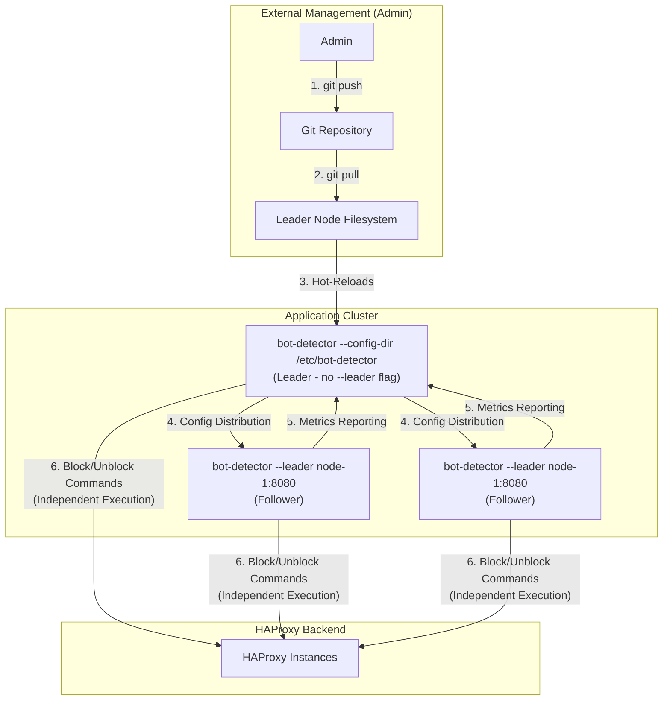
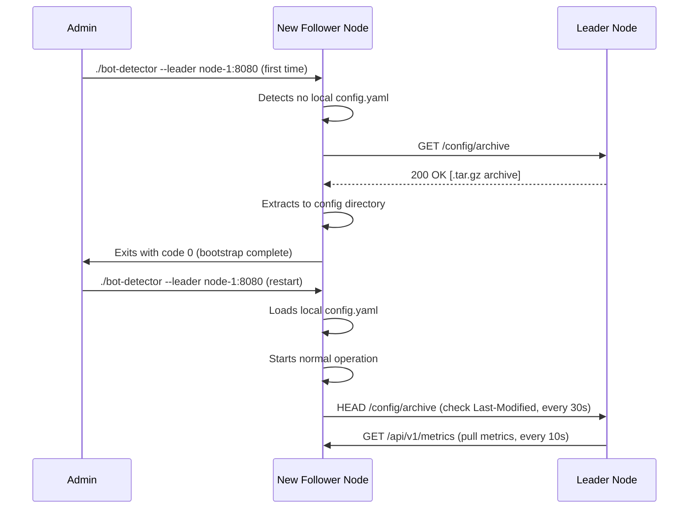
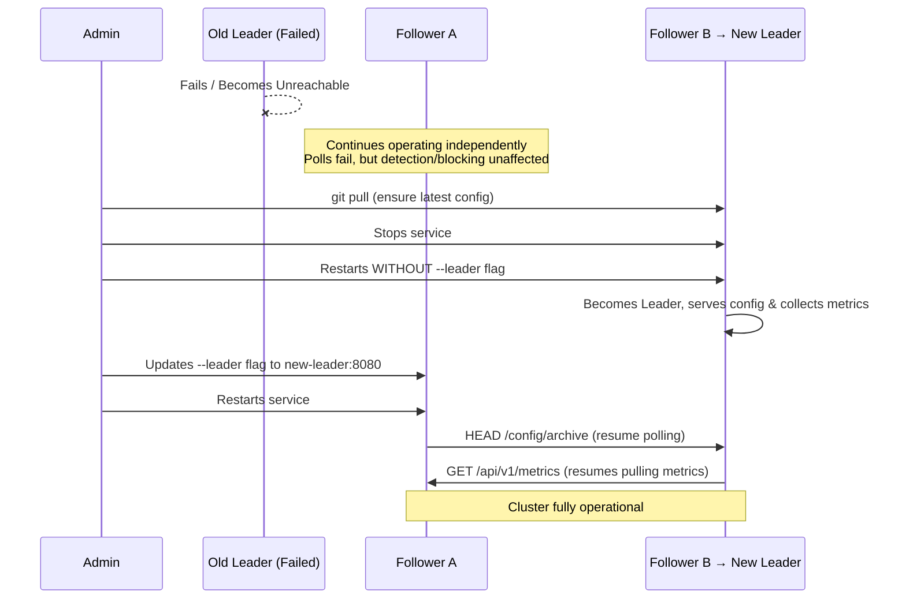

> **Note:** This document outlines a proposed design and is currently a Work in Progress.

# Multi-Instance Cluster Architecture

This document describes the Leader/Follower architecture for `bot-detector` clusters. This model enables configuration synchronization and metrics aggregation while maintaining independent threat detection and execution on each node.

## Guiding Principles

- **Simple Code:** Prioritize straightforward, maintainable implementations over complex optimizations.
- **Independent Execution:** All instances detect threats and send commands to HAProxy independently. Duplicate commands are acceptable since HAProxy handles them naturally (updates existing stick-table entries).
- **Admin-Managed Source of Truth:** A central Git repository is the recommended source of truth for configuration. Administrators update the leader's configuration, which propagates to followers.
- **Centralized Visibility:** The leader aggregates metrics from all followers to provide cluster-wide observability.
- **Fault Tolerance:** Each instance operates autonomously. Leader failure does not stop threat detection or blocking—only config updates and metrics aggregation are affected.

## Architecture Overview

The system uses a Leader/Follower model where:

- **Leader** serves configuration and collects cluster-wide metrics (pull-based)
- **Followers** poll for config updates and expose their local metrics via API
- **All instances** independently detect threats and execute HAProxy commands

This creates a bidirectional data flow:



### Key Design Characteristics

1. **Independent Execution:** Each instance parses its own log stream, detects threats using behavioral chains, and sends block/unblock commands directly to HAProxy. This ensures low latency and no single point of failure for threat mitigation.

2. **Acceptable Duplicates:** Multiple instances may detect and block the same IP. HAProxy naturally handles this by updating existing stick-table entries, so duplicate commands cause no functional issues.

3. **Configuration Sync:** The leader (node running without `--leader` flag) serves the authoritative configuration. Followers poll periodically for updates and hot-reload when changes are detected.

4. **Metrics Aggregation:** The leader collects metrics from all followers (blocks per chain, top IPs, error rates, etc.) and provides a unified cluster-wide dashboard.

---

## Configuration

### Command-Line Flags

The node's role (leader or follower) is determined by the presence of the `--leader` flag:

-   **No `--leader` flag:** The instance operates as the **Leader**. It serves its on-disk configuration to followers and aggregates cluster metrics by polling all followers.
-   `--leader <hostname:port>`: The instance operates as a **Follower**. It polls the specified leader for configuration updates and exposes its metrics via API for the leader to collect. On first connection (or if no local config exists), the follower automatically bootstraps by downloading the configuration, saving it locally, and exiting. On subsequent starts, it operates normally.

**Examples:**

```bash
# Start as leader (no --leader flag)
./bot-detector --config-dir /etc/bot-detector --log-path /var/log/haproxy/access.log

# Start as follower (first time - will bootstrap and exit)
./bot-detector --leader node-1.internal:8080

# Start as follower (normal operation after bootstrap)
./bot-detector --leader node-1.internal:8080
```

### Configuration Archive Format

The `/config/archive` endpoint serves a `.tar.gz` archive containing the complete configuration needed to run bot-detector. This includes:

- **`config.yaml`**: The main configuration file
- **All file dependencies**: Any files referenced in the configuration via `file:` directives (e.g., `good_actors_ips.txt`, `http2_paths.txt`, custom regex files, etc.)

The archive preserves the directory structure, allowing followers to extract it directly into their configuration directory. When the leader builds the archive, it recursively includes all files discovered during configuration loading.

**Archive Integrity:**
- The `/config/archive` endpoint includes a checksum in the response headers (e.g., `ETag` or `X-Config-Checksum`)
- Followers can verify archive integrity by comparing checksums
- This protects against corruption during transfer

### `config.yaml` - Identical on All Nodes

**Critical:** The configuration file must be **exactly identical** on all nodes in the cluster. This ensures consistent behavior and simplifies management.

The config contains a list of all cluster members for metrics aggregation and monitoring:

```yaml
# This exact config is used on ALL nodes (leader and followers)
version: "1.0"

# Standard bot-detector configuration (chains, blockers, etc.)
chains:
  # ... your behavioral chains ...

blocker_addresses:
  - "haproxy-1.internal:9999"
  - "haproxy-2.internal:9999"

# Cluster configuration
cluster:
  nodes:
    - name: "node-1"
      address: "node-1.internal:8080"
    - name: "node-2"
      address: "node-2.internal:8080"
    - name: "node-3"
      address: "node-3.internal:8080"
  config_poll_interval: "30s"      # How often followers check for config updates (via HEAD)
  metrics_report_interval: "10s"   # How often leader pulls metrics from followers (via GET)
  http_protocol: "http"            # Protocol for leader communication (http or https)
```

**How It Works:**
- The leader uses the `cluster.nodes` list to know which followers to query for metrics
- Each node identifies itself by matching its listen address (e.g., `:8080`) against the `cluster.nodes[].address` entries
- When responding to metrics requests, nodes include their `name` from the matched cluster entry
- All nodes share the same chains, blocker addresses, and other configuration

**Node Identity:**
A node determines its identity by:
1. Checking which address it's listening on (from `cluster.nodes[].address` or a default)
2. Matching this address against entries in `cluster.nodes`
3. Using the corresponding `name` field for identification in metrics and logs

For example, if a node listens on `node-2.internal:8080`, it identifies as `"node-2"` based on the matching entry in the config.

---

## Detailed Scenarios

### 1. Updating the Configuration

Configuration updates are managed by administrators and external to the application.

1.  **Commit Change:** An admin pushes a configuration change to the central Git repository.
2.  **Update Leader:** The admin connects to the **Leader** node and updates its configuration files from the repository (e.g., by running `git pull` or deploying updated files).
3.  **Hot-Reload (Leader):** The Leader's `bot-detector` instance detects the file change on disk and automatically hot-reloads the new configuration.
4.  **Propagation:** Follower nodes poll the leader periodically (default: every 30s) using HEAD requests to `/config/archive` to check the `Last-Modified` header. When they detect a configuration change, they download the updated archive using a GET request and hot-reload it.

**Timeline:**
```
T+0s:    Admin updates leader's config file
T+0s:    Leader hot-reloads automatically
T+0-30s: Followers detect change on next poll
T+30s:   All followers have new config
```

**Note on Race Conditions:**
When the leader adds new `good_actors` entries and reloads its config:
- The leader unblocks any currently blocked IPs that match the new good actors (if `unblock_on_good_actor` is enabled)
- However, followers with stale configs (0-30s polling window) may still block IPs that were just whitelisted
- Once followers receive the updated config, they will also unblock those IPs
- This creates a brief window where an IP might be temporarily re-blocked, but this is acceptable given the independent execution model

### 2. Bootstrapping a New Follower

This scenario covers adding a brand new, unconfigured instance to an existing cluster.

**Automatic Bootstrap Process:**

The application automatically detects when it's being run for the first time and handles the bootstrap process without requiring a separate flag or command.

1.  **First Start:** Administrator starts `bot-detector` with `--leader` flag pointing at the leader node:
    ```sh
    ./bot-detector --leader node-1.internal:8080
    ```

2.  **Bootstrap Detection:** The application detects that no local `config.yaml` file exists.

3.  **One-Time Fetch:** The instance makes a single API call to the leader's `/config/archive` endpoint to download the complete configuration package.

4.  **Extract & Exit:** The instance:
    - Extracts the archive to the local configuration directory (e.g., `/etc/bot-detector/`)
    - Logs success and **exits with code 0**

5.  **Normal Operation:** The administrator restarts the service with the same command:
    ```sh
    ./bot-detector --leader node-1.internal:8080
    ```
    This time, the local config exists, so the instance skips bootstrap and starts normally as a follower.

**Bootstrap Re-trigger:**
If a follower with an existing local config is restarted with the `--leader` flag:
- Bootstrap is **skipped** (config already exists)
- The follower starts normally and immediately begins polling the leader
- On the first poll, if the leader's config is newer (based on `Last-Modified`), the follower downloads and hot-reloads it
- This ensures followers with stale configs quickly catch up without manual intervention

#### Interaction Diagram



### 3. Failover Procedure

This model uses a straightforward manual failover process that ensures consistency and maintains operational simplicity.

**Scenario:** The Leader node fails or becomes unreachable.

**Impact During Leader Failure:**
- ✅ **Threat detection continues:** All followers continue to parse logs, detect threats, and send commands to HAProxy
- ✅ **Blocking continues:** No impact on core security functionality
- ❌ **No config updates:** Followers cannot receive new configuration changes
- ❌ **No centralized metrics:** Cluster-wide metrics dashboard is unavailable

**Failover Steps:**

1.  **Choose New Leader:** Administrator selects an existing follower to promote to leader.

2.  **Ensure Consistency:** Connect to the chosen node and verify its configuration is up-to-date:
    ```sh
    cd /etc/bot-detector
    git pull  # or deploy updated config files
    ```
    **This is a critical manual step** to ensure the new leader has the latest configuration.

3.  **Promote to Leader:** Restart the chosen instance **without** the `--leader` flag:
    ```sh
    systemctl stop bot-detector
    # Update systemd service file to REMOVE --leader flag
    systemctl start bot-detector
    ```
    The instance will now operate as the leader.

4.  **Update Followers:** Restart all other followers, pointing them at the new leader:
    ```sh
    systemctl stop bot-detector
    # Update systemd service file: --leader new-leader-hostname:8080
    systemctl start bot-detector
    ```

**Alternative - DNS-Based Failover:**

For operational simplicity, use a stable DNS name for the leader:

```bash
# Followers always use the same DNS name
./bot-detector --leader bot-leader.internal:8080
```

During failover, update the DNS record to point at the new leader. Followers will automatically reconnect on their next poll cycle (default: 30s).

#### Interaction Diagram



---

## API Endpoints

The following HTTP endpoints are used for cluster coordination:

### Leader Endpoints

| Endpoint | Method | Purpose | Used By |
|----------|--------|---------|---------|
| `/config/archive` | HEAD | Check `Last-Modified` and checksum headers (e.g., `ETag`) for config version | Followers (poll) |
| `/config/archive` | GET | Serves the current configuration as a `.tar.gz` archive with checksum header | Followers (download) |
| `/api/v1/metrics/cluster` | GET | Returns aggregated metrics from all followers | Admins (dashboard) |

### Follower Endpoints

| Endpoint | Method | Purpose | Used By |
|----------|--------|---------|---------|
| `/api/v1/metrics` | GET | Returns local instance metrics as JSON (includes node `name` for identification) | Leader (collection) |
| `/api/v1/status` | GET | Returns instance status (role, uptime, version, node name) | Monitoring |

### Shared Endpoints (All Instances)

| Endpoint | Method | Purpose |
|----------|--------|---------|
| `/metrics` | GET | Prometheus-compatible metrics (local instance) |
| `/health` | GET | Health check endpoint |

---

## Metrics Aggregation

The leader periodically **pulls** metrics from all followers to provide cluster-wide visibility. Each node stores its own metrics locally and exposes them via the `/api/v1/metrics` endpoint. The leader queries all followers at regular intervals (configured via `metrics_report_interval`, default: 10s).

**Metrics Collection Model:**
- **Pull-based**: Leader actively queries followers via `GET /api/v1/metrics`
- **Local storage**: Each node maintains its own metrics in memory
- **No push**: Followers do not proactively send metrics to the leader
- **Periodic refresh**: Leader updates the cluster dashboard on each poll cycle

**Metrics Collected Per Instance:**
- Total lines processed
- Parse errors
- Chains completed (per chain)
- Actions triggered (blocks, logs)
- Top active IPs (per chain)
- HAProxy command statistics
- Good actors skipped

**Leader Aggregation:**
- Queries each follower listed in `cluster.nodes` via `GET /api/v1/metrics`
- Each response includes the node's `name` field for identification
- Sums counters across all instances
- Merges top-N lists (e.g., most blocked IPs cluster-wide)
- Provides per-instance breakdown
- Tracks follower health (last seen, response time, poll failures)

**Example Cluster Dashboard View:**
```
Cluster Summary (3 instances)
├─ Total Lines Processed: 1,234,567
├─ Total Blocks Issued: 523
├─ Active Followers: 3/3
└─ Top Blocked IPs (cluster-wide):
   1. 192.0.2.45 (blocked by: instance-1, instance-3)
   2. 198.51.100.23 (blocked by: instance-2)
   3. 203.0.113.89 (blocked by: instance-1, instance-2, instance-3)

Per-Instance Metrics:
├─ instance-1 (leader): 412,345 lines, 201 blocks, healthy
├─ instance-2: 398,234 lines, 167 blocks, healthy
└─ instance-3: 423,988 lines, 155 blocks, healthy
```

---

## Implementation Notes

### State Management
- Each instance maintains its own persistence (state snapshots + journal)
- State is NOT shared between instances
- Each instance can independently recover from crashes using its local state
- Leader does not dictate or override follower state

### Network Tolerance
- Followers gracefully handle temporary leader unavailability
- Config polls and metrics reporting use reasonable timeouts
- Failed requests are logged but don't block normal operation
- Followers continue operating with last known configuration

### Security Considerations
- Leader API endpoints should be restricted to internal network
- Consider using HTTPS for production deployments (configure via `cluster.http_protocol`)
- No authentication is implemented in the initial design (rely on network isolation)
- Future enhancement: Add API token authentication for leader/follower communication