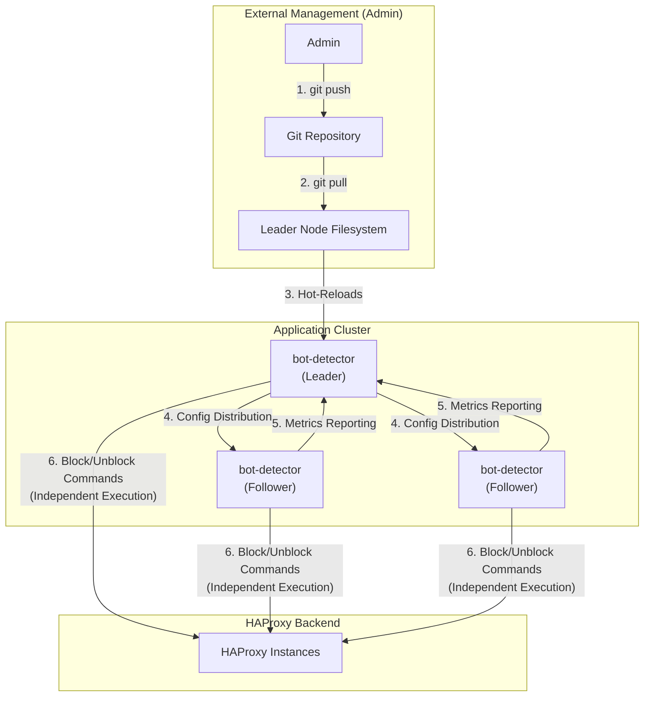
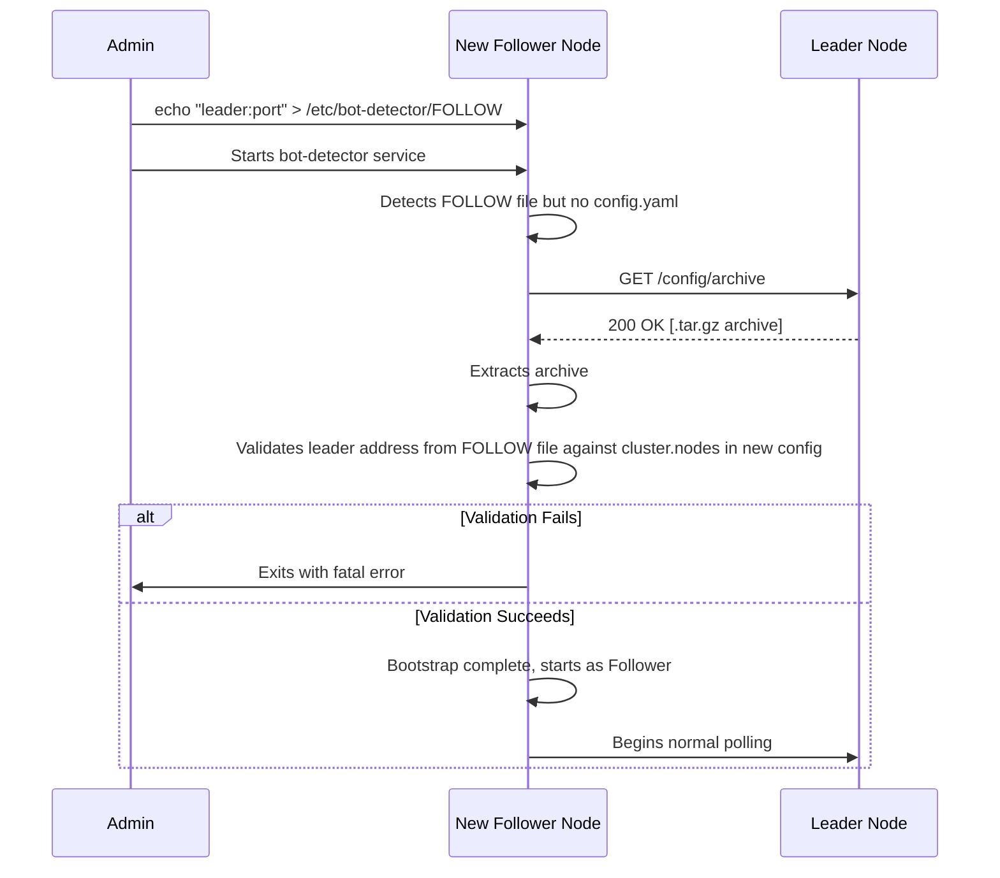
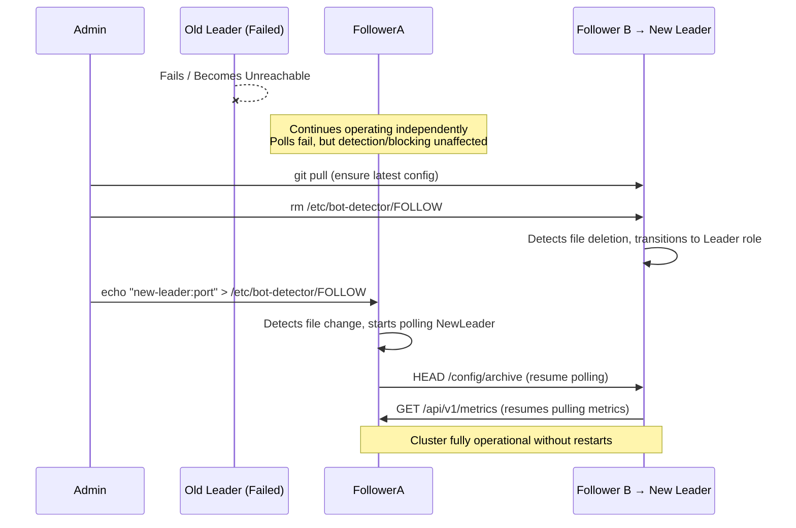

# Multi-Instance Cluster Architecture

This document describes the Leader/Follower architecture for `bot-detector` clusters. This model enables configuration synchronization and metrics aggregation while maintaining independent threat detection and execution on each node.

## Implementation Status

The cluster implementation is **complete and operational** as of Phases 1-7:

- ✅ **Configuration synchronization**: Leader serves config via `/config/archive`, followers poll and hot-reload
- ✅ **Bootstrap mode**: New followers can start with only a `FOLLOW` file and fetch initial config
- ✅ **Metrics collection**: Leader polls followers via `/cluster/metrics` at configurable intervals
- ✅ **Metrics aggregation**: Cluster-wide metrics available via `/cluster/metrics/aggregate`
- ✅ **Node health tracking**: Automatic health status determination (healthy/stale/error)
- ✅ **Dynamic role changes**: Nodes can transition between leader/follower without restart
- ✅ **FOLLOW file mechanism**: Role designation via presence/absence of FOLLOW file

**Future enhancements** (Phases 8-12) include retry logic with exponential backoff, HTTPS support, comprehensive integration tests, and optional features. See `work_in_progress/cluster2.md` for detailed planning.

## Guiding Principles

- **Simple Code:** Prioritize straightforward, maintainable implementations over complex optimizations.
- **Independent Execution:** All instances detect threats and send commands to HAProxy independently. Duplicate commands are acceptable since HAProxy handles them naturally (updates existing stick-table entries).
- **Admin-Managed Source of Truth:** A central Git repository is the recommended source of truth for configuration. Administrators update the leader's configuration, which propagates to followers.
- **Centralized Visibility:** The leader aggregates metrics from all followers to provide cluster-wide observability.
- **Fault Tolerance:** Each instance operates autonomously. Leader failure does not stop threat detection or blocking—only config updates and metrics aggregation are affected.

## Architecture Overview

The system uses a Leader/Follower model where:

- **Leader** serves configuration and collects cluster-wide metrics (pull-based)
- **Followers** poll for config updates and expose their local metrics via API
- **All instances** independently detect threats and execute HAProxy commands

This creates a bidirectional data flow:



### Key Design Characteristics

1. **Independent Execution:** Each instance parses its own log stream, detects threats using behavioral chains, and sends block/unblock commands directly to HAProxy. This ensures low latency and no single point of failure for threat mitigation.

2. **Acceptable Duplicates:** Multiple instances may detect and block the same IP. HAProxy naturally handles this by updating existing stick-table entries, so duplicate commands cause no functional issues.

3. **Configuration Sync:** The leader serves the authoritative configuration. Followers poll periodically for updates and hot-reload when changes are detected.

4. **Metrics Aggregation:** The leader collects metrics from all followers (blocks per chain, top IPs, error rates, etc.) and provides a unified cluster-wide dashboard.

---

## Configuration

### Role Designation (Leader/Follower)

The node's role (leader or follower) is determined by the presence of a file named `FOLLOW` in the configuration directory.

-   **No `FOLLOW` file:** If `/etc/bot-detector/FOLLOW` does not exist, the instance operates as the **Leader**. It serves its on-disk configuration to followers and aggregates cluster metrics by polling all followers.
-   **`FOLLOW` file exists:** If `/etc/bot-detector/FOLLOW` exists, the instance operates as a **Follower**. The contents of this file must be the address of the leader node (e.g., `node-1.internal:8080`), which must match an entry in the `cluster.nodes` configuration. The follower polls the specified leader for configuration updates and exposes its metrics via API for the leader to collect.

**Examples:**

```bash
# Start as leader (/etc/bot-detector/FOLLOW does not exist)
./bot-detector --config-dir /etc/bot-detector --log-path /var/log/haproxy/access.log

# Start as follower (/etc/bot-detector/FOLLOW contains "node-1.internal:8080")
./bot-detector --config-dir /etc/bot-detector --log-path /var/log/haproxy/access.log
```

### Operational Scenarios

The instance's behavior is determined by the state of the configuration files at startup and any changes detected during runtime.

| Scenario | Trigger | `config.yaml` State | `FOLLOW` File State | Expected Behavior |
| :--- | :--- | :--- | :--- | :--- |
| **Standalone** | App Start | `present (no cluster section)` | `absent` | Runs as a standalone instance. No cluster activity. |
| **Leader** | App Start | `present (with cluster section)` | `absent` | Runs as **Leader**. Serves config and polls metrics from followers. |
| **Follower** | App Start | `present` | `present (valid)` | Runs as **Follower**. Polls leader specified in `FOLLOW`. |
| **Bootstrap Follower**| App Start | `absent` | `present` | **Bootstraps.** Fetches config from leader, validates it, and starts as Follower. |
| **Promote to Leader** | File deleted | `present` | `deleted` | **Transitions to Leader.** Stops polling and begins serving config/polling others. |
| **Demote to Follower** | File created | `present` | `created (valid)` | **Transitions to Follower.** Stops serving and begins polling the new leader. |
| **Re-point Follower** | File modified | `present` | `modified (valid)` | **Switches leader.** Begins polling the new leader. |
| **Error - Invalid Bootstrap** | App Start | `absent` | `present (invalid after check)` | Logs a **fatal error** and exits. The instance has no valid config. |
| **Error - Invalid Runtime** | File modified | `present` | `modified (invalid)` | Logs an **error**, **rejects the change**, and continues polling the old leader. |
| **Error - Invalid Demotion**| File created | `present (no cluster section)` | `created` | Logs an **error**. Ignores `FOLLOW` file. Remains Standalone. |

### Configuration Archive Format

The `/config/archive` endpoint serves a `.tar.gz` archive containing the complete configuration needed to run bot-detector. This includes:

- **`config.yaml`**: The main configuration file
- **All file dependencies**: Any files referenced in the configuration via `file:` directives (e.g., `good_actors_ips.txt`, `http2_paths.txt`, custom regex files, etc.)

The archive preserves the directory structure, allowing followers to extract it directly into their configuration directory. When the leader builds the archive, it recursively includes all files discovered during configuration loading.

**Archive Integrity:**
- The `/config/archive` endpoint includes a checksum in the response headers (e.g., `ETag` or `X-Config-Checksum`)
- Followers can verify archive integrity by comparing checksums
- This protects against corruption during transfer

### `config.yaml` - Identical on All Nodes

**Critical:** The configuration file must be **exactly identical** on all nodes in the cluster. This ensures consistent behavior and simplifies management.

The config contains a list of all cluster members for metrics aggregation and monitoring:

```yaml
# This exact config is used on ALL nodes (leader and followers)
version: "1.0"

# Standard bot-detector configuration (chains, blockers, etc.)
chains:
  # ... your behavioral chains ...

blocker_addresses:
  - "haproxy-1.internal:9999"
  - "haproxy-2.internal:9999"

# Cluster configuration
cluster:
  nodes:
    - name: "node-1"
      address: "node-1.internal:8080"
    - name: "node-2"
      address: "node-2.internal:8080"
    - name: "node-3"
      address: "node-3.internal:8080"
  config_poll_interval: "30s"      # How often followers check for config updates (via HEAD)
  metrics_report_interval: "10s"   # How often leader pulls metrics from followers (via GET)
  http_protocol: "http"            # Protocol for leader communication (http or https)
```

**How It Works:**
- The leader uses the `cluster.nodes` list to know which followers to query for metrics
- Each node identifies itself by matching its listen address (e.g., `:8080`) against the `cluster.nodes[].address` entries
- When responding to metrics requests, nodes include their `name` from the matched cluster entry
- All nodes share the same chains, blocker addresses, and other configuration

**Node Identity:**
A node determines its identity by:
1. Checking which address it's listening on (from `cluster.nodes[].address` or a default)
2. Matching this address against entries in `cluster.nodes`
3. Using the corresponding `name` field for identification in metrics and logs

For example, if a node listens on `node-2.internal:8080`, it identifies as `"node-2"` based on the matching entry in the config.

---

## Detailed Scenarios

### 1. Updating the Configuration

Configuration updates are managed by administrators and external to the application.

1.  **Commit Change:** An admin pushes a configuration change to the central Git repository.
2.  **Update Leader:** The admin connects to the **Leader** node and updates its configuration files from the repository (e.g., by running `git pull` or deploying updated files).
3.  **Hot-Reload (Leader):** The Leader's `bot-detector` instance detects the file change on disk and automatically hot-reloads the new configuration.
4.  **Propagation:** Follower nodes poll the leader periodically (default: every 30s) using HEAD requests to `/config/archive` to check the `Last-Modified` header. When they detect a configuration change, they download the updated archive using a GET request and hot-reload it.

**Timeline:**
```
T+0s:    Admin updates leader's config file
T+0s:    Leader hot-reloads automatically
T+0-30s: Followers detect change on next poll
T+30s:   All followers have new config
```

**Note on Race Conditions:**
When the leader adds new `good_actors` entries and reloads its config:
- The leader unblocks any currently blocked IPs that match the new good actors (if `unblock_on_good_actor` is enabled)
- However, followers with stale configs (0-30s polling window) may still block IPs that were just whitelisted
- Once followers receive the updated config, they will also unblock those IPs
- This creates a brief window where an IP might be temporarily re-blocked, but this is acceptable given the independent execution model

### 2. Bootstrapping a New Follower

This scenario covers adding a brand new, unconfigured instance to an existing cluster. The process is dynamic and does not require restarts.

**Automatic Bootstrap Process:**

1.  **Prepare Follower:** An administrator prepares the new follower node by creating the configuration directory and a `FOLLOW` file containing the leader's address:
    ```sh
    mkdir -p /etc/bot-detector
    echo "node-1.internal:8080" > /etc/bot-detector/FOLLOW
    ```

2.  **Start Service:** The administrator starts the `bot-detector` service.
    ```sh
    ./bot-detector --config-dir /etc/bot-detector
    ```

3.  **Bootstrap Detection:** On startup, the instance detects that `/etc/bot-detector/FOLLOW` exists, but `config.yaml` does not. This triggers the bootstrap process.

4.  **Fetch Configuration:** The instance reads the leader's address from the `FOLLOW` file and downloads the complete configuration package from the leader's `/config/archive` endpoint.

5.  **Validate and Extract:**
    - The instance extracts the `config.yaml` from the archive.
    - **Crucially, it validates that the leader address from the `FOLLOW` file exists in the `cluster.nodes` list within the newly downloaded configuration.**
    - If the address is not found, the instance logs a fatal error and exits. This prevents configuration mismatches.
    - If validation succeeds, it extracts the rest of the archive to the configuration directory.

6.  **Transition to Follower:** After a successful bootstrap, the instance proceeds to start normal operation as a follower without needing a restart.

#### Interaction Diagram



### 3. Failover Procedure

This model uses a dynamic, manual failover process that does not require service restarts, ensuring high availability.

**Scenario:** The Leader node fails or becomes unreachable.

**Impact During Leader Failure:**
- ✅ **Threat detection continues:** All followers continue to parse logs, detect threats, and send commands to HAProxy.
- ✅ **Blocking continues:** No impact on core security functionality.
- ❌ **No config updates:** Followers cannot receive new configuration changes.
- ❌ **No centralized metrics:** Cluster-wide metrics dashboard is unavailable.

**Dynamic Failover Steps:**

1.  **Choose New Leader:** Administrator selects an existing follower to promote (e.g., "node-2").

2.  **Ensure Consistency:** Connect to the chosen node and verify its configuration is up-to-date. **This is a critical manual step.**
    ```sh
    cd /etc/bot-detector
    git pull  # or deploy updated config files
    ```

3.  **Promote to Leader:** On the chosen node ("node-2"), **delete** the `FOLLOW` file. The running `bot-detector` instance will detect this change and dynamically transition its role to Leader.
    ```sh
    rm /etc/bot-detector/FOLLOW
    ```

4.  **Update Other Followers:** On all other follower nodes, **modify** the `FOLLOW` file to point to the new leader's address. The running instances will detect the change and start polling the new leader.
    ```sh
    echo "node-2.internal:8080" > /etc/bot-detector/FOLLOW
    ```

The entire cluster is now operating with a new leader without any downtime.

#### Interaction Diagram



---

## API Endpoints

The following HTTP endpoints are used for cluster coordination:

### Leader Endpoints

| Endpoint | Method | Purpose | Used By |
|----------|--------|---------|---------|
| `/config/archive` | HEAD | Check `Last-Modified` header for config version | Followers (poll) |
| `/config/archive` | GET | Serves the current configuration as a `.tar.gz` archive | Followers (download) |
| `/cluster/metrics/aggregate` | GET | Returns aggregated metrics from all followers | Admins (dashboard) |

### Follower Endpoints

| Endpoint | Method | Purpose | Used By |
|----------|--------|---------|---------|
| `/cluster/metrics` | GET | Returns local instance metrics as JSON (includes node `name` for identification) | Leader (collection) |

### Shared Endpoints (All Instances)

| Endpoint | Method | Purpose | Used By |
|----------|--------|---------|---------|
| `/cluster/status` | GET | Returns instance status (role, name, address, leader) | Monitoring |
| `/` or `/stats` | GET | HTML metrics report | Admins (browser) |
| `/stats/steps` | GET | Plain text step execution counts | Admins (monitoring) |
| `/config` | GET | Raw YAML configuration content | Admins (inspection) |

---

## Metrics Aggregation

The leader periodically **pulls** metrics from all followers to provide cluster-wide visibility. Each node stores its own metrics locally and exposes them via the `/cluster/metrics` endpoint. The leader queries all followers at regular intervals (configured via `metrics_report_interval`, default: 10s).

**Metrics Collection Model:**
- **Pull-based**: Leader actively queries followers via `GET /cluster/metrics`
- **Local storage**: Each node maintains its own metrics in memory
- **No push**: Followers do not proactively send metrics to the leader
- **Periodic refresh**: Leader updates the cluster dashboard on each poll cycle

**Metrics Collected Per Instance:**
- Total lines processed
- Parse errors
- Chains completed (per chain)
- Actions triggered (blocks, logs)
- Top active IPs (per chain)
- HAProxy command statistics
- Good actors skipped

**Leader Aggregation:**
- Queries each follower listed in `cluster.nodes` via `GET /cluster/metrics`
- Each response includes the node's `name` field for identification
- Sums counters across all instances
- Provides per-instance breakdown with health status (healthy/stale/error)
- Tracks follower health (last collected time, consecutive errors)
- Available via `GET /cluster/metrics/aggregate` endpoint

**Example Cluster Dashboard View:**
```
Cluster Summary (3 instances)
├─ Total Lines Processed: 1,234,567
├─ Total Blocks Issued: 523
├─ Active Followers: 3/3
└─ Top Blocked IPs (cluster-wide):
   1. 192.0.2.45 (blocked by: instance-1, instance-3)
   2. 198.51.100.23 (blocked by: instance-2)
   3. 203.0.113.89 (blocked by: instance-1, instance-2, instance-3)

Per-Instance Metrics:
├─ instance-1 (leader): 412,345 lines, 201 blocks, healthy
├─ instance-2: 398,234 lines, 167 blocks, healthy
└─ instance-3: 423,988 lines, 155 blocks, healthy
```

---

## Implementation Notes

### State Management
- Each instance maintains its own persistence (state snapshots + journal)
- State is NOT shared between instances
- Each instance can independently recover from crashes using its local state
- Leader does not dictate or override follower state

### Network Tolerance
- Followers gracefully handle temporary leader unavailability
- Config polls and metrics reporting use reasonable timeouts
- Failed requests are logged but don't block normal operation
- Followers continue operating with last known configuration

### Security Considerations
- Leader API endpoints should be restricted to internal network
- Consider using HTTPS for production deployments (configure via `cluster.http_protocol`)
- No authentication is implemented in the initial design (rely on network isolation)
- Future enhancement: Add API token authentication for leader/follower communication
