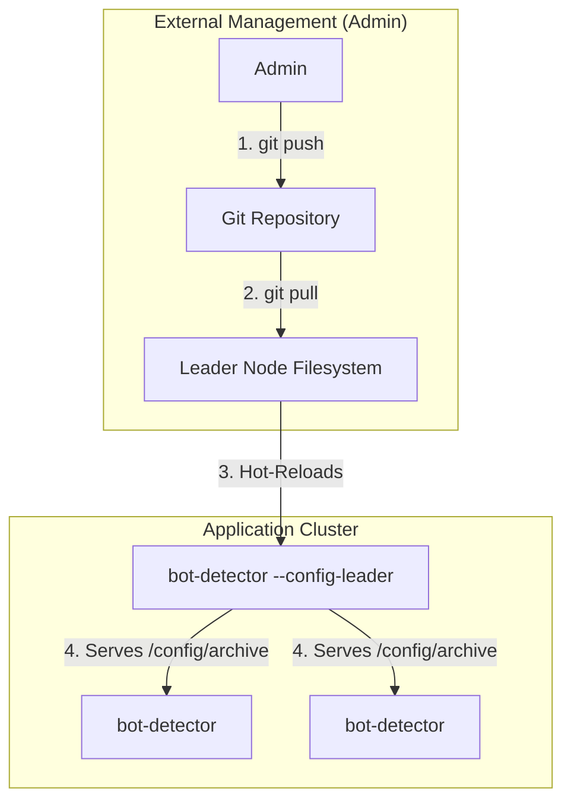
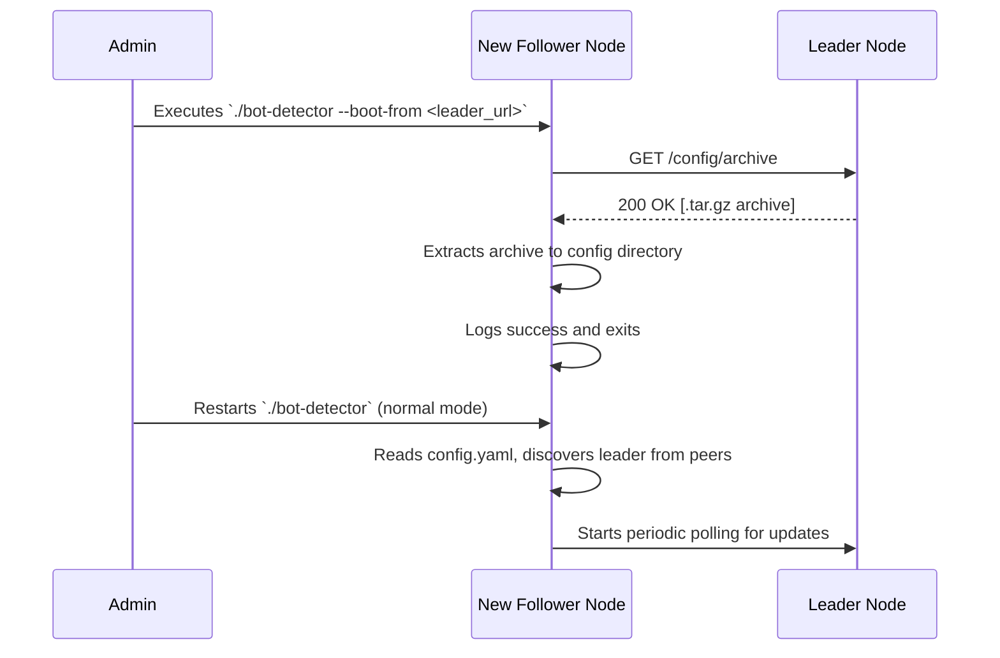
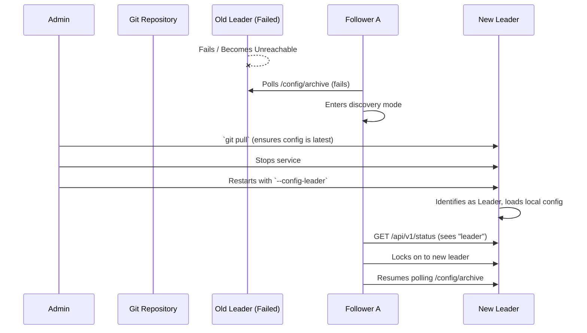

> **Note:** This document outlines a proposed design and is currently a Work in Progress.

# Multi-Instance Configuration Management

This document describes the Leader/Follower architecture used to synchronize configuration across a cluster of `bot-detector` instances. This model is designed for environments where configuration changes are infrequent and operational simplicity is a priority.

## Guiding Principles

- **Admin-Managed Source of Truth:** A central Git repository is the recommended source of truth for configuration, but its management is external to the application. Administrators are responsible for updating the leader's configuration from this source.
- **Identical Configuration:** All nodes in the cluster run with the exact same `config.yaml` file. The application's behavior (Leader or Follower) is determined solely by a command-line flag.
- **Simplicity:** The application's role is simple distribution, not external source management. This makes the system easy to understand and troubleshoot.
- **Reliability:** The manual failover process is straightforward and ensures consistency.

## Architecture Overview

The system uses a Leader/Follower model. A single **Leader** node, designated at startup, acts as the authoritative source for all **Follower** nodes. The application itself does not interact with Git; it only synchronizes the configuration from the designated leader.

This creates a clear, one-way data flow for distribution:



---

## Configuration

### Command-Line Flags

-   `--config-leader`: Designates the instance as the **Leader**. This instance serves its on-disk configuration to followers.
-   `--boot-from <leader_url>`: A one-time flag used to initialize a new **Follower** instance with its first configuration.

### `config.yaml` (Identical on all nodes)

All nodes share the same configuration file, which simply lists all members of the cluster.

```yaml
# config.yaml - Use this exact file on all nodes
config_sync:
  enabled: true
  # A list of all potential members of the cluster.
  peers:
    - "http://node-1.internal:8080"
    - "http://node-2.internal:8080"
    - "http://node-3.internal:8080"
  poll_interval: "30s"
```

---

## Detailed Scenarios

### 1. Updating the Configuration

This process is managed by an administrator and is external to the application's logic.

1.  **Commit Change:** An admin pushes a configuration change to the central Git repository.
2.  **Update Leader:** The admin connects to the **Leader** node and updates its configuration files from the repository (e.g., by running `git pull`).
3.  **Hot-Reload:** The Leader's `bot-detector` instance detects the file change on its disk and automatically hot-reloads the new configuration.
4.  **Propagation:** Follower nodes, on their next poll cycle, will download the updated configuration archive from the leader and hot-reload it themselves.

### 2. Bootstrapping a New Follower

This scenario covers adding a brand new, unconfigured instance to an existing cluster.

1.  **Initiation:** An administrator runs the `bot-detector` command on the new machine, pointing it at any existing member of the cluster.
    ```sh
    ./bot-detector --boot-from http://leader-node.internal:8080
    ```
2.  **One-Time Fetch:** The new instance makes a single API call to `/config/archive` of the target node to download the complete configuration.
3.  **Extraction & Exit:** The instance extracts the archive into its local configuration directory (e.g., `/etc/bot-detector/`) and then **exits**.
4.  **Normal Start:** The administrator starts the service again, this time *without* the `--boot-from` flag. The instance now has the correct `config.yaml` and will operate as a normal follower.

#### Interaction Diagram



### 3. Failover Procedure

This model uses a simple and safe manual failover process.

**Scenario:** The Leader node fails or becomes unreachable.

1.  **Failure Detection:** Follower nodes fail to poll the leader and enter a "discovery" mode, continuously checking all peers to find a new leader. They continue operating with their last known configuration.
2.  **Admin Intervention:** An administrator chooses an existing follower to be the new leader.
3.  **Ensure Consistency:** The administrator connects to the chosen machine and ensures its configuration is up-to-date by running `git pull`. **This is a critical manual step.**
4.  **Promotion:** The administrator stops the `bot-detector` service on that machine and restarts it, adding the `--config-leader` flag.
5.  **Discovery by Peers:** The other followers, still in their discovery loop, will poll the newly promoted node, see its role has changed to "leader," and begin syncing from it.

#### Interaction Diagram

