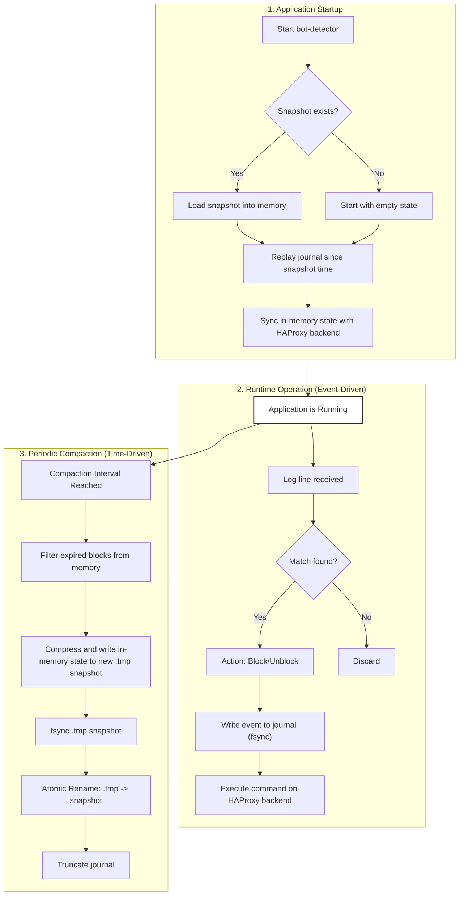

# Bot-Detector Persistence and State Management

This document outlines the architecture used by `bot-detector` to reliably persist its state, ensuring that block information can be restored after a restart.

## Enabling Persistence

Persistence is disabled by default. To enable it, you **must** specify a state directory using the `--state-dir` command-line flag. This flag is the sole method for enabling persistence and setting the storage path.

```sh
./bot-detector --config-dir /etc/bot-detector --state-dir /var/lib/bot-detector/state
```

You can optionally control other persistence behaviors, like the compaction interval, from your `config.yaml` file. If `persistence.enabled` is set to `true` in the YAML, the `--state-dir` flag becomes mandatory.

```yaml
# config.yaml
persistence:
  enabled: true
  compaction_interval: "1h" # Optional, defaults to 1 hour
```

If a `state_dir` is provided, the application will create the directory if it doesn't exist and manage its state within it.

## Guiding Principles

- **Local State is Truth:** The state stored locally by `bot-detector` is the source of truth. The backend's (e.g., HAProxy) state is considered a replica that will be automatically synchronized on startup.
- **Reliability:** The system prioritizes durably recording every action to prevent data loss.
- **Backend Agnostic:** The persistence model is self-contained and does not depend on the specific backend it manages.
- **Unified State Management:** The system tracks both blocked IPs (`gpc0=1`) and explicitly unblocked IPs (`gpc0=0`) to ensure complete state restoration after crashes or HAProxy restarts.

## Core Components

The persistence model is a "Log-and-Snapshot" design, which relies on two key files within the configured `state_dir`:

### 1. The Journal (Event Log)

This is an append-only log file where every state-changing action is recorded *before* it is executed.

- **Format:** JSON Lines (JSONL). Each line is a complete JSON object representing a single event.
- **Content:** Records all `block` and `unblock` events, including timestamp, IP, duration, and the reason for the action.
- **Durability:** When a new event is logged, the file is explicitly flushed to disk (`fsync`). This guarantees that if the application crashes, a record of the intended action exists and will be correctly applied on the next startup.
- **Lifecycle:** This log grows during operation and is cleared by the Compaction process. It only contains events that have occurred since the last snapshot.

### 2. The Snapshot (State File)

This file is a complete, point-in-time snapshot of all IP states known to the system.

- **Format:** A gzip-compressed JSON object. The application automatically compresses snapshots on write and decompresses them on read.
- **Content:** Contains the timestamp of the snapshot and all IP states (both blocked and unblocked).
- **Compression:** Snapshots are automatically gzipped to reduce disk usage (typically 80-90% size reduction) and improve I/O performance.
- **Backward Compatibility:** The loader automatically detects and handles both gzipped and legacy plain JSON snapshots by checking the gzip magic number.
- **Reliability:** The snapshot is written using an **atomic rename** pattern (`compress -> write to .tmp -> fsync -> rename`). This ensures that a valid, non-corrupt snapshot is always available, even if the application crashes mid-write.
- **Purpose:** Its primary role is to ensure fast application startups by avoiding the need to replay a long history of events.

## Visual Overview

The following diagram illustrates the lifecycle of the persistence components during startup, runtime, and compaction.



## Key Processes

### Startup and State Restoration

On startup, `bot-detector` follows a specific process to bring the backend's state into sync with its local source of truth.

1.  **Load Snapshot:** The application loads the snapshot into memory. If the file doesn't exist, it starts with an empty state.
2.  **Replay Journal:** It reads the journal and applies any events that are newer than the snapshot's timestamp, ensuring the in-memory state is fully up-to-date.
3.  **State Push:** `bot-detector` iterates through its complete in-memory state and issues commands to the configured backend:
    - **Block commands** (`gpc0=1`) for all blocked IPs with remaining duration
    - **Unblock commands** (`gpc0=0`) for all explicitly unblocked IPs (good actors)
    
    This process is idempotent and ensures the backend converges to the correct state without causing a service interruption.

> **Note:** During the "State Push" phase, the application respects the *currently loaded* configuration. This means if an IP address exists in the state snapshot but is also listed in the current `good_actors` configuration, its block will **not** be restored to the backend.

### Runtime Event Logging

Every block or unblock action follows this sequence:

1. **Write to Journal:** The event is written to the journal file and flushed to disk
2. **Update In-Memory State:** The internal state map is updated
3. **Execute Backend Command:** The command is queued for the backend (rate-limited)

This ensures that even if the backend command fails or the application crashes, the event is preserved and will be replayed on restart.

### Compaction

To prevent the journal from growing infinitely, a periodic compaction process runs. The interval is configurable via `compaction_interval` in the YAML config (default is 1 hour).

1.  **Filter State:** Remove expired blocked IPs from in-memory state (unblocked IPs have no expiration)
2.  **Snapshot:** Create a new, clean gzipped snapshot of the current in-memory state using the atomic rename pattern
3.  **Truncate:** Once the new compressed snapshot is safely on disk, the journal is truncated (cleared), as all its information is now consolidated in the new snapshot

**Compaction Logging:**
```
COMPACTION: Snapshot written (size=1234 bytes, entries=100 blocked + 5 unblocked, expired=15)
COMPACTION: Journal truncated and reset
```

## Failure Scenarios

| Failure Type | System Behavior | Outcome | Key Feature |
| :--- | :--- | :--- | :--- |
| **App Crash (Normal)** | Replays journal on restart to recover state since last snapshot. | **Highly Resilient.** State is self-healed. | Journaling |
| **App Crash (Compaction)** | Safely ignores temporary files and uses the last good snapshot and journal. | **Highly Resilient.** No state is lost. | Atomic Rename |
| **HAProxy Restart** | Full state (blocks + unblocks) is restored on next bot-detector startup. | **Resilient.** Good actor protections preserved. | Unified State |
| **Disk Full** | Write operations fail; the app logs errors and may halt. | **Safe.** Prevents state inconsistency. | Error Handling on I/O |
| **Network Failure** | A single block command is retried based on `blocker_max_retries`. | **Resilient.** The state will be fully synchronized on the next restart. | Per-Command Retries |

### Crash During Normal Operation

If the application crashes after writing an event to the journal but before executing it on the backend, the startup process will automatically correct the situation. The journaled event is replayed, added to the in-memory state, and pushed to the backend, ensuring no actions are lost.

### Crash During Compaction

The compaction process is transactional. If a crash occurs, the state remains consistent because the old snapshot and journal are not deleted until the new snapshot is successfully written.

### HAProxy Restart Scenario

If HAProxy is restarted while bot-detector is running, all stick table entries are lost. When bot-detector restarts:

1. Loads snapshot with both blocked and unblocked IPs
2. Replays journal to get latest state
3. Sends **both** block and unblock commands to HAProxy
4. Result: Full state restoration including good actor protections (`gpc0=0`)

## Disaster Recovery from a Snapshot Backup

If the entire server is lost, the snapshot file is the key asset for recovery.

### Restoration Procedure

1.  **Prepare New Server:** Set up a new machine with the `bot-detector` binary and its backend.
2.  **Restore Snapshot:** Place the backed-up snapshot file into the state directory. **Ensure no journal file is present.**
3.  **Start Application:** Launch `bot-detector`. It will load the snapshot (automatically detecting the format version), see there is no journal to replay, and proceed to push the state to the backend.
4.  **Resume:** The system will create a new journal and resume normal operation.

This means your Recovery Point Objective (RPO) is determined by how frequently you back up the snapshot file.

### Backup Considerations

- **Format Compatibility:** Snapshot files are gzip-compressed for efficiency. Both compressed and legacy plain JSON snapshots can be restored.
- **Version Detection:** The application automatically detects v0 or v1 format and handles conversion transparently.
- **Size:** Gzipped snapshots are typically 80-90% smaller than plain JSON, making backups faster and more storage-efficient.
- **Inspection:** To manually inspect a gzipped snapshot:
  - v0: `gunzip -c state.snapshot | jq .`
  - v1: `gunzip -c snapshot.v1.gz | jq .`

---

## Format Specifications

### v0 Format (Legacy)

The original persistence format, still fully supported for backward compatibility.

#### File Naming
- **Snapshot:** `state.snapshot` (gzipped JSON)
- **Journal:** `events.log` (JSONL)

#### Snapshot Structure
```json
{
  "version": "v0",
  "snapshot_time": "2025-11-21T12:00:00Z",
  "active_blocks": {
    "192.0.2.1": {
      "unblock_time": "2025-11-21T13:00:00Z",
      "reason": "chain-name"
    }
  }
}
```

**Characteristics:**
- Only stores **blocked IPs** (no unblocked state)
- Flat map structure with IP as key
- Version field may be absent in very old snapshots (defaults to v0)

#### Journal Entry Format
```json
{"version":"v0","ts":"2025-11-21T12:00:00Z","event":"block","ip":"192.0.2.1","duration":3600000000000,"reason":"chain-name"}
{"version":"v0","ts":"2025-11-21T12:00:01Z","event":"unblock","ip":"192.0.2.2","reason":"good-actor-match"}
```

**Characteristics:**
- Flat structure with all fields at top level
- `event` field contains event type ("block" or "unblock")
- Duration in nanoseconds for block events

#### Limitations
- **No unblock state preservation:** When an IP is unblocked, it's removed from state entirely
- **Lost good actor protections:** After restart, unblocked IPs (`gpc0=0`) are not restored to HAProxy
- **No chronological ordering:** Snapshot entries are unordered

---

### v1 Format (Current)

The enhanced format with unified state management and improved structure.

#### File Naming
- **Snapshot:** `snapshot.v1.gz` (gzipped JSON)
- **Journal:** `events.v1.log` (JSONL)

#### Snapshot Structure
```json
{
  "ts": "2025-11-21T12:00:00Z",
  "snapshot": {
    "entries": [
      {
        "ip": "192.0.2.1",
        "state": "blocked",
        "expire_time": "2025-11-21T13:00:00Z",
        "reason": "chain-name"
      },
      {
        "ip": "192.0.2.2",
        "state": "unblocked",
        "expire_time": "2025-11-21T14:00:00Z",
        "reason": "good-actor-match"
      }
    ]
  }
}
```

**Characteristics:**
- Stores **both blocked and unblocked IPs**
- Wrapped structure: timestamp at top level, data nested in `snapshot` object
- Entries are **sorted chronologically** by `expire_time`
- No `version` field (format detected by structure)
- `state` field explicitly indicates "blocked" or "unblocked"

#### Journal Entry Format
```json
{"ts":"2025-11-21T12:00:00Z","event":{"type":"block","ip":"192.0.2.1","duration":3600000000000,"reason":"chain-name"}}
{"ts":"2025-11-21T12:00:01Z","event":{"type":"unblock","ip":"192.0.2.2","reason":"good-actor-match"}}
```

**Characteristics:**
- Wrapped structure: timestamp at top level, event data nested in `event` object
- `type` field (not `event`) contains event type
- No `version` field (format detected by structure)
- Cleaner separation of metadata from payload

#### Advantages
- **Complete state restoration:** Both blocks and unblocks are preserved
- **Good actor protection:** Unblocked IPs (`gpc0=0`) are restored to HAProxy after restart
- **Chronological ordering:** Snapshot entries sorted by expiration time for efficient processing
- **Cleaner structure:** Consistent wrapping pattern for both snapshot and journal
- **Future-proof:** Easier to add metadata fields without touching event structure

#### Migration from v0 to v1

The application handles v0 to v1 migration transparently:

1. **Loading v0 files:** Automatically detected and converted to internal v1 structure
2. **Writing v1 files:** New snapshots use v1 format with version-aware naming
3. **Backward compatibility:** v0 files remain readable indefinitely
4. **Unblocked IPs:** When loading v0 snapshots, only blocked IPs are present; unblocked state is built from journal replay

**Example migration:**
```
Before (v0):
  state.snapshot (3 blocked IPs)
  events.log (10 blocks + 2 unblocks)

After restart with v1:
  snapshot.v1.gz (11 blocked + 2 unblocked IPs)
  events.v1.log (new events in v1 format)
```

---

## Logging Output

The application provides detailed logging for all persistence operations:

### Startup
```
STATE_LOAD: Loaded snapshot (version=v1, size=1234 bytes, entries=100 blocked + 5 unblocked, timestamp=2025-11-21T12:00:00Z)
JOURNAL_REPLAY: Replayed journal (size=5678 bytes, blocks=10, unblocks=2, skipped=50, errors=0)
STATE_RESTORE: Restoring 105 IP states to backend...
```

### Runtime
```
JOURNAL_FAIL: Failed to write block event to journal for 192.0.2.1: disk full
```

### Compaction
```
COMPACTION: Snapshot written (size=1300 bytes, entries=95 blocked + 7 unblocked, expired=15)
COMPACTION: Journal truncated and reset
```

The logging provides visibility into:
- File sizes for capacity planning
- Entry counts for monitoring state growth
- Event counts for auditing
- Error conditions for troubleshooting
